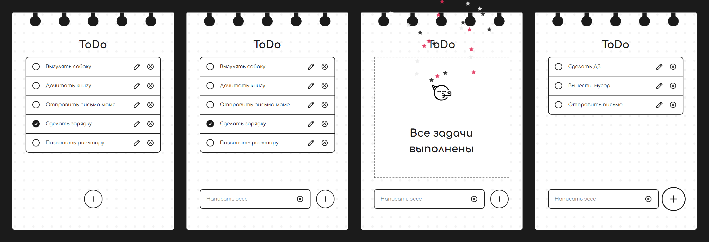

# To-Do
[Опубликованная версия🡕]()

## Описание 

Минималистичный список задач, позволяющий пользователям добавлять, редактировать, удалять и помечать задачи как выполненные.

## :gear: Функциональные возможности

- Для сохранения данных о задачах между сессиями импользовано хранилище LocalStorage.
- При завершении всех задач появляется анимация конфетти, выполненная с помощью библиотеки [canvas-confetti🡕](https://github.com/catdad/canvas-confetti)

## :crystal_ball: Используемые технологии

<table>
  <tr>
    <td width="70" align='center'>
      
       
      HTML
    </td>
    <td width="70" align='center'>
      
       
      CSS
    </td>
    <td width="70" align='center'>
      
       
      JavaScript
    </td>
    <td width="70" align='center'>
      
       
      БЭМ
    </td>
    <td width="70" align='center'>
      
       
      LocalStorage
    </td>
  </tr>
</table>

## :game_die: Архитектура
### **Модульный код**
Программа разделена на небольшие функции, каждая из которых отвечает за свой функционал.
### **Чистая структура**
Понятные имена функций обеспечивают читаемость кода.
### **Комментарии**
Код снабжен комментариями, которые объясняют его функциональность.
## :star2: Преимущества
### **Адаптивный дизайн** 
Веб-приложение имеет адаптивный дизайн, обеспечивающий одинаково хороший пользовательский опыт на различных устройствах.
### **Кроссбраузерность** 
Веб-приложение идентично отображается в последних версиях основных браузеров.
